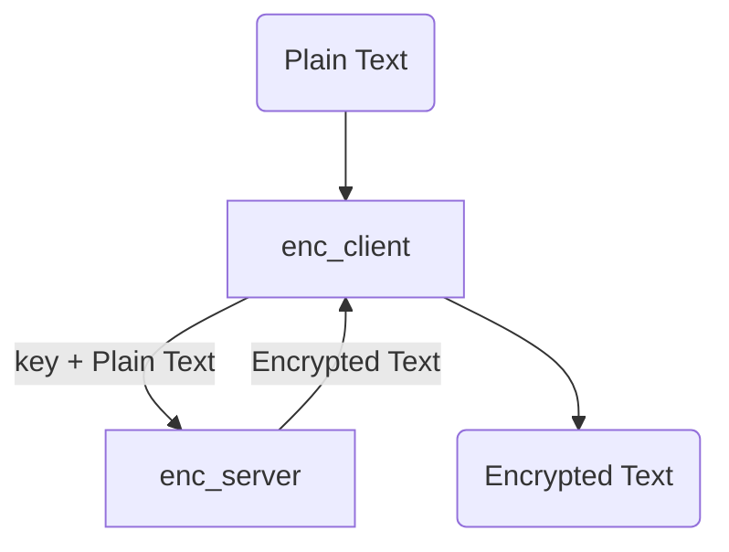
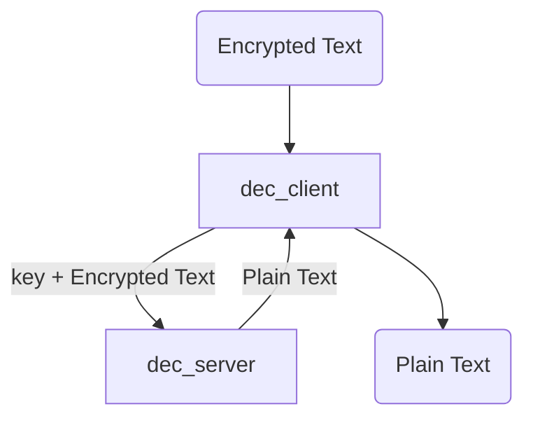

# TCP Encryption Server

The **TCP Encryption Server** is a simple client and server application that provides end-to-end encryption for data communication over TCP/IP. This server is designed to ensure the security and privacy of data transmitted between clients and the server itself.

## Features

- **End-to-End Encryption**: All data transmitted between clients and the server is encrypted, ensuring that sensitive information remains confidential.

- **Client Authentication**: The server can authenticate clients, ensuring that only authorized parties can establish a connection.

- **<Sarcasm>World's Most Secure Encryption Algorithm</Sarcasm>**: The server employs strong encryption algorithms to protect data, making it suitable for secure communications.

## Usage

1. **Client Connection**: Clients can establish secure connections with the server using the specified port and encryption settings.

2. **Data Transmission**: All data transmitted between clients and the server is automatically encrypted and decrypted as necessary, ensuring the security of the communication.

3. **Authentication (Optional)**: If enabled, clients must authenticate themselves to the server using secure authentication mechanisms before establishing a connection.

## Configuration

### Encryption:

A encryption key is generated and this key along with a plain text file is given to the enc_client. The client then communicates with the enc_server which encrypts the text file and then this encrypted file is presented back to the user.

### Decryption:

An encrypted text file is given to the dec_client. This client then communicates with the dec_server which decrypts the text file with the provided decryption key, then the dec_client sends the decrypted text file back to the user.

## Contributing

Contributions to the TCP Encryption Server project are welcome! If you have any ideas for improvements or would like to report a bug, please [create an issue](https://github.com/osborneandrewj/tcp-encryption-server/issues).

## License

This project is licensed under the MIT License. See the [LICENSE](https://github.com/osborneandrewj/tcp-encryption-server/blob/main/LICENSE) file for details.

## Acknowledgments

- This server application was developed by Andrew Osborne as a demonstration project.

Thank you for using the TCP Encryption Server! Enjoy secure and private data communication using this server.
